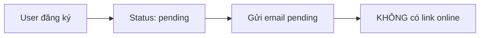
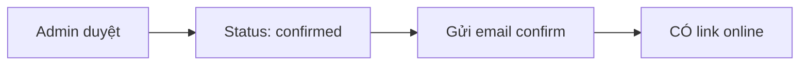

# 📧 Email Logic Guide - Event Registration

## 🎯 **Logic Overview**

Đối với sự kiện có phí và có link tham gia online, hệ thống email hoạt động theo 2 giai đoạn:

### 📝 **Giai đoạn 1: Đăng ký (Trạng thái "Chờ duyệt")**
- **Email gửi**: `registrationPending.ts`
- **Nội dung**: KHÔNG kèm link online
- **Mục đích**: Thông báo đăng ký đã được nhận, đang chờ admin duyệt

### ✅ **Giai đoạn 2: Admin duyệt (Trạng thái "Confirmed")**
- **Email gửi**: `registrationConfirm.ts`
- **Nội dung**: CÓ kèm link online
- **Mục đích**: Xác nhận đăng ký thành công và cung cấp link tham gia

---

## 🔧 **Technical Implementation**

### 📧 **Email Pending (Chờ duyệt)**

```typescript
// File: lib/email/templates/registrationPending.ts
export function generateRegistrationPendingEmail(data: RegistrationPendingEmailData) {
  // KHÔNG hiển thị onlineLink trong email
  // Chỉ hiển thị thông tin cơ bản về sự kiện
  // Thông báo rằng link sẽ được gửi sau khi admin duyệt
}
```

**Nội dung email:**
- ✅ Thông tin sự kiện cơ bản
- ✅ Mã giao dịch
- ❌ **KHÔNG có link online**
- ✅ Thông báo "Link sẽ được gửi sau khi admin duyệt"

### 📧 **Email Confirm (Xác nhận)**

```typescript
// File: lib/email/templates/registrationConfirm.ts
export function generateRegistrationConfirmEmail(data: RegistrationEmailData) {
  // CÓ hiển thị onlineLink trong email
  // Nhấn mạnh rằng link đã được admin duyệt
}
```

**Nội dung email:**
- ✅ Thông tin sự kiện đầy đủ
- ✅ **CÓ link online với nút tham gia nổi bật**
- ✅ Ghi chú "Link đã được admin duyệt"
- ✅ Hướng dẫn sử dụng link

---

## 🎨 **Visual Differences**

### 📱 **Email Pending (Chờ duyệt)**
```
┌─────────────────────────────────┐
│ ⏳ ĐANG XỬ LÝ THANH TOÁN        │
│                                 │
│ 📅 Workshop ESP32 Advanced      │
│ 🕒 14:00 - 17:00               │
│ 📍 Online - Zoom Meeting       │
│ 💰 200,000 VNĐ                 │
│                                 │
│ 💳 Mã giao dịch: TXN123456789  │
│                                 │
│ 📝 Lưu ý:                      │
│ • Link online sẽ được gửi sau   │
│   khi admin duyệt               │
└─────────────────────────────────┘
```

### ✅ **Email Confirm (Xác nhận)**
```
┌─────────────────────────────────┐
│ 🎉 ĐĂNG KÝ THÀNH CÔNG!          │
│                                 │
│ 📅 Workshop ESP32 Advanced      │
│ 🕒 14:00 - 17:00               │
│ 📍 Online - Zoom Meeting       │
│ 💰 200,000 VNĐ                 │
│                                 │
│ 🚀 [THAM GIA SỰ KIỆN ONLINE]    │
│    ✅ Link đã được admin duyệt  │
│                                 │
│ 📋 Bước tiếp theo:              │
│ • Lưu lại email này             │
│ • Chuẩn bị tài liệu             │
└─────────────────────────────────┘
```

---

## 🔄 **Workflow Process**

### 1️⃣ **User Registration**


### 2️⃣ **Admin Approval**


---

## 🛠️ **Code Changes Made**

### 📝 **registrationPending.ts**
- ❌ Removed: `onlineLink` display in HTML
- ❌ Removed: `onlineLink` in text version
- ✅ Added: Note about link being sent after approval
- ✅ Updated: "Sẽ được gửi sau khi admin duyệt"

### ✅ **registrationConfirm.ts**
- ✅ Enhanced: Link display with admin approval note
- ✅ Added: "✅ Link này đã được admin duyệt"
- ✅ Improved: Visual styling for online link button

---

## 🧪 **Testing**

### 📧 **Test Scenarios**

1. **Paid Event + Online Link**
   - Registration → Pending email (no link)
   - Admin approval → Confirm email (with link)

2. **Free Event + Online Link**
   - Registration → Immediate confirm (with link)

3. **Paid Event + No Online Link**
   - Registration → Pending email (no link)
   - Admin approval → Confirm email (no link)

4. **Free Event + No Online Link**
   - Registration → Immediate confirm (no link)

---

## 📋 **Key Benefits**

### 🔒 **Security**
- Link online chỉ được chia sẻ sau khi admin xác thực
- Tránh spam và lạm dụng link

### 👥 **User Experience**
- User hiểu rõ quy trình duyệt
- Không bị nhầm lẫn về link
- Thông tin rõ ràng về trạng thái

### 🎯 **Admin Control**
- Admin có quyền kiểm soát link
- Có thể quản lý số lượng tham gia
- Dễ dàng theo dõi trạng thái

---

## 🚀 **Implementation Status**

- ✅ Email pending logic updated
- ✅ Email confirm logic updated
- ✅ Visual improvements added
- ✅ Security measures implemented
- ✅ User experience enhanced

**Ready for production!** 🎉
